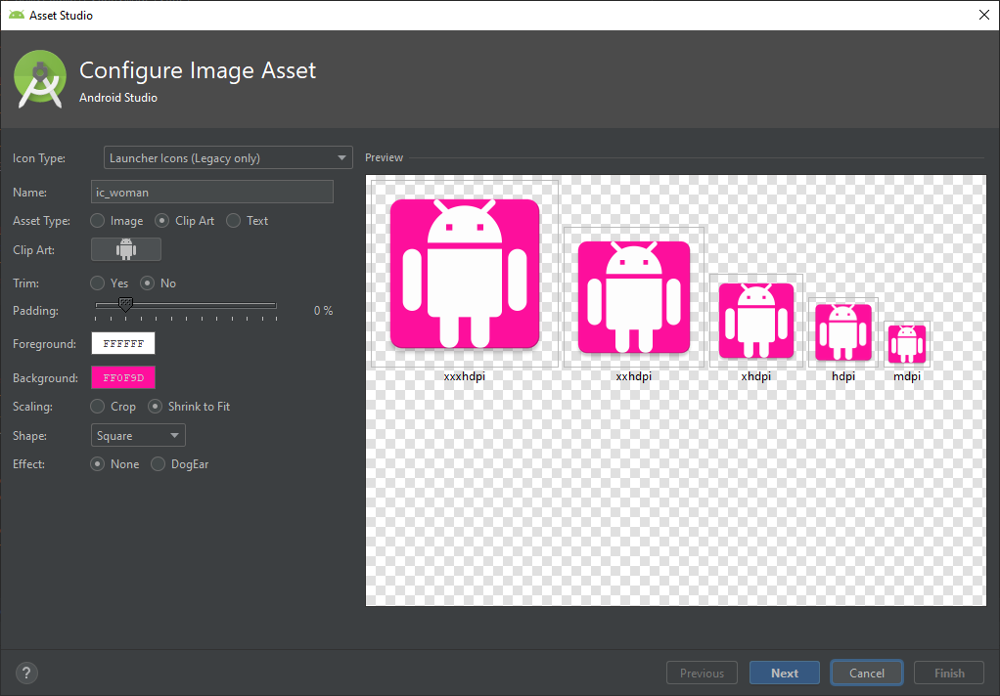
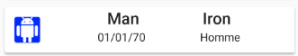

La version imagée : https://drive.google.com/open?id=1e_j-8dQzh2TLu6U-AEeyOyXjNPOLmXb7

# TP4 Connexion aux API

Une fois de plus, on peut repartir avec le TP précédent.

Dans ce dernier TP, nous allons découvrir comment accéder à des données externes et comment les utiliser dans notre application.

## 1 RecyclerView 

### 1.1 100 % écolo

Pour gérer les listes, il existe un layout spécifique appelé ```ListView```. Mais celui-ci est un peu décrié et on préfère le ```RecyclerView``` car il permet de réaliser des vues plus complexes et variées. Son efficacité pour afficher des grandes listes n'est plus à prouver notamment au niveau du rafraichissement où il ne redessinera pas l'ensemble de la liste mais juste les éléments mis à jour.

Pour afficher les données, nous aurons besoin de créer un ```Adapter``` qui adaptera les données venues de votre API ou de la base de données.

Tout d'abord la petite librairie.

```kotlin
implementation 'androidx.recyclerview:recyclerview:1.0.0'
```

Créez ensuite un nouveau fragment : ```fragment_list.xml```. Il est composé d'un ```ConstraintLayout``` et d'un ```RecyclerView```.

```xml
<layout xmlns:android="http://schemas.android.com/apk/res/android"
        xmlns:app="http://schemas.android.com/apk/res-auto"
        xmlns:tools="http://schemas.android.com/tools">

    <data>

        <variable
                name="viewModel"
                type="com.example.tp2.viewmodel.ListViewModel" />
    </data>

    <androidx.constraintlayout.widget.ConstraintLayout
            android:layout_width="match_parent"
            android:layout_height="match_parent">


        <androidx.recyclerview.widget.RecyclerView
                android:id="@+id/list"
                android:layout_width="match_parent"
                android:layout_height="match_parent"
                app:layoutManager="androidx.recyclerview.widget.LinearLayoutManager"
                app:layout_constraintBottom_toBottomOf="parent"
                app:layout_constraintLeft_toLeftOf="parent"
                app:layout_constraintRight_toRightOf="parent"
                app:layout_constraintTop_toTopOf="parent" />

    </androidx.constraintlayout.widget.ConstraintLayout>
</layout>
```

Le ```RecyclerView``` possède un manager : ```LinearLayoutManager```. Celui-ci permet d'afficher les éléments dans une liste verticale en pleine largeur.

Pensez à créer la classe correspondant au layout ```ListFragment.kt```. Pour l'instant, on ne va pas le remplir donc vous ne pouvez pas compiler.

Pensez aussi à faire le lien entre les deux fragments comme dans les tps précédents.

<div style="page-break-after: always;"></div>

### 1.2 Les éléments

Les éléments de notre ```RecyclerView``` ne sont pas directement contenus dans la bloc XML. Il faut alors créer un template de ce que l'on souhaitera afficher qu'on nommera ```item_view.xml```.

```xml
<?xml version="1.0" encoding="utf-8"?>
<androidx.cardview.widget.CardView
        android:layout_margin="6dp"
        android:layout_width="match_parent"
        android:layout_height="wrap_content"
        xmlns:android="http://schemas.android.com/apk/res/android"
        xmlns:app="http://schemas.android.com/apk/res-auto">

    <androidx.constraintlayout.widget.ConstraintLayout
            android:layout_width="match_parent"
            android:layout_height="wrap_content">

        <TextView
                android:id="@+id/tv_lastname_item"
                android:textSize="20sp"
                android:textAppearance="@style/TextAppearance.AppCompat.Title"
                app:layout_constraintTop_toTopOf="parent"
                app:layout_constraintRight_toLeftOf="@+id/tv_firstname_item"
                app:layout_constraintLeft_toLeftOf="parent"
                android:layout_marginBottom="10dp"
                android:layout_width="wrap_content"
                android:layout_height="wrap_content" />

        <TextView
                android:id="@+id/tv_firstname_item"
                android:textSize="20sp"
                android:textAppearance="@style/TextAppearance.AppCompat.Title"
                app:layout_constraintTop_toTopOf="parent"
                app:layout_constraintRight_toRightOf="parent"
                app:layout_constraintLeft_toRightOf="@+id/tv_lastname_item"
                android:layout_width="wrap_content"
                android:layout_height="wrap_content" />

        <TextView
                android:id="@+id/tv_birthday_item"
                android:textSize="14sp"
                android:textAppearance="@style/TextAppearance.AppCompat.Body1"
                app:layout_constraintTop_toBottomOf="@+id/tv_firstname_item"
                app:layout_constraintRight_toLeftOf="@+id/tv_gender_item"
                app:layout_constraintLeft_toLeftOf="parent"
                android:layout_width="wrap_content"
                android:layout_height="wrap_content" />

        <TextView
                android:id="@+id/tv_gender_item"
                android:textSize="14sp"
                android:textAppearance="@style/TextAppearance.AppCompat.Body1"
                app:layout_constraintTop_toBottomOf="@+id/tv_firstname_item"
                app:layout_constraintRight_toRightOf="parent"
                app:layout_constraintLeft_toRightOf="@+id/tv_birthday_item"
                android:layout_width="wrap_content"
                android:layout_height="wrap_content" />

    </androidx.constraintlayout.widget.ConstraintLayout>
</androidx.cardview.widget.CardView>
```

### 1.3 S'adapter au changement

Lorsqu'on utilise un ```RecyclerView```, on est obligé de créer un adapteur. L'adaptateur va nous aider à créer un détenteur de vue et à le remplir avec les données à afficher.<br />
Dans un nouveau package ```adapter```, on créer un fichier ```MyListAdapter.kt```.

```kotlin
class MyListAdapter : RecyclerView.Adapter<MyListAdapter.MyViewHolder>() {

    class MyViewHolder(itemView: View) : RecyclerView.ViewHolder(itemView) {
        val lastnameTv: TextView = itemView.findViewById(R.id.tv_lastname_item)
        val firstnameTv: TextView = itemView.findViewById(R.id.tv_firstname_item)
        val birthdayTv: TextView = itemView.findViewById(R.id.tv_birthday_item)
        val genderTv: TextView = itemView.findViewById(R.id.tv_gender_item)
    }

    var data = listOf<User>()
        set(value) {
            field = value
            notifyDataSetChanged()
        }

    override fun getItemCount() = data.size

    override fun onCreateViewHolder(parent: ViewGroup, viewType: Int): MyViewHolder {

    }

    override fun onBindViewHolder(holder: MyViewHolder, position: Int) {


    }
}
```

Premièrement, l'adapteur est lié à un ```ViewHolder```. Celui-ci dispose de variables qui implémenteront les différentes vues afin d'y accéder via le code.

Egalement, plusieurs méthodes et variables sont à implémenter. Tout d'abord une fonction ```getItemCount()``` qui retourne le nombre de données. Puis, ```onBindViewHolder()``` qui est appelée pour afficher les données d'un élément de la liste à la position spécifiée. Donc deux arguments sont passés en paramètre : le détenteur de vue et la position dans la liste. Enfin, ```onCreateViewHolder()``` permet d'initialiser l'élément dans le ```RecyclerView```.

En somme, dans la fonction de création on aura un "inflater" qui crée la vue à partir de la mise en page XML dans le ```RecyclerView```.

Pour indiquer au ```RecyclerView``` qu'un élément de la liste a été modifié et doit être mis à jour, on utilise la méthode ```notifyDataSetChanged()```.

```kotlin
val layoutInflater = LayoutInflater.from(parent.context)
val view = layoutInflater.inflate(R.layout.item_view, parent, false)
return MyViewHolder(view)
```

Dans la méthode de liaison, on récupère donc les données et on les affecte aux vues.

```kotlin
val item = data[position]
val date = Date(item.birthdayDate)
val format = SimpleDateFormat("dd/MM/yyyy")

holder.firstnameTv.text =  item.firstname
holder.lastnameTv.text =  item.lastname
holder.birthdayTv.text =  format.format(date)
holder.genderTv.text =  item.gender
```

<div style="page-break-after: always;"></div>

Si on revient désormais au sein du fragment, il faut que l'on crée notre ```ViewModel``` et son ```ViewModelFactory```.

```kotlin
class ListViewModel(
    val database: UserDao,
    application: Application
) : AndroidViewModel(application)
{

    private var viewModelJob = Job()
    private val uiScope = CoroutineScope(Dispatchers.Main + viewModelJob)

    private val _users = MutableLiveData<List<User>>()
    val users: LiveData<List<User>>
        get() = _users

    init {
        Log.i("ListViewModel", "created")
        initializeUsers()
    }

    private fun initializeUsers() {
        uiScope.launch {
            _users.value = getUsersFromDatabase()
        }
    }

    private suspend fun getUsersFromDatabase(): List<User>? {
        return withContext(Dispatchers.IO) {

            var users = database.getUsers()
            users
        }
    }

    override fun onCleared() {
        super.onCleared()
        Log.i("ListViewModel", "destroyed")
        viewModelJob.cancel()
    }
}
```

```kotlin
class ListViewModelFactory (
    private val dataSource: UserDao,
    private val application: Application
) : ViewModelProvider.Factory {
    @Suppress("unchecked_cast")
    override fun <T : ViewModel?> create(modelClass: Class<T>): T {
        if (modelClass.isAssignableFrom(ListViewModel::class.java)) {
            return ListViewModel(dataSource, application) as T
        }
        throw IllegalArgumentException("Unknown ViewModel class")
    }
}
```

Pensez à ajouter la nouvelle requête dans le DAO :

```kotlin
@Query("SELECT * FROM user")
fun getUsers(): List<User>?
```

Avant d'enfin compléter le fragment :

```kotlin
class ListFragment :  Fragment() {

    override fun onCreateView(
        inflater: LayoutInflater,
        container: ViewGroup?,
        savedInstanceState: Bundle?
    ): View? {
        val binding: FragmentListBinding = DataBindingUtil.inflate(
            inflater, R.layout.fragment_list, container, false)

        val application = requireNotNull(this.activity).application

        val dataSource = MyDatabase.getInstance(application).userDao
        val viewModelFactory = ListViewModelFactory(dataSource, application)

        val viewModel =
            ViewModelProviders.of(
                this, viewModelFactory).get(ListViewModel::class.java)

        binding.viewModel = viewModel
        binding.lifecycleOwner = this

        val adapter = MyListAdapter()
        binding.list.adapter = adapter

        viewModel.users.observe(viewLifecycleOwner, Observer {
            it?.let {
                adapter.data = it
            }
        })

        return binding.root
    }
}
```

On observe qu'ici, on instancie notre adapteur ```MyListAdapter``` et qu'on l'affecte, grâce au binding, à notre élément de vue ```<RecyclerView>```. Enfin, on observe les modifications de la liste pour affecter les valeurs lorsque celles-ci sont récupérées.

En résumé :
+ Le ```RecyclerView``` est conçu pour être efficace même lors de l'affichage de très grandes listes.
+ Le ```RecyclerView``` effectue uniquement le travail nécessaire pour traiter ou dessiner les éléments visibles à l'écran.
+ Lorsqu'un élément disparaît de l'écran, ses vues sont recyclées. Cela signifie que l'élément est rempli avec un nouveau contenu qui défile sur l'écran.

Pour afficher vos données dans un ```RecyclerView```, vous avez besoin des éléments suivants:
+ ```RecyclerView```
    + Définir un élément ```<RecyclerView>``` dans le fichier de mise en page.
+ ```LayoutManager```
    + Un ```RecyclerView``` utilise un ```LayoutManager``` pour organiser la disposition des éléments, par exemple en les plaçant dans une grille ou dans une liste linéaire.
+ ```Mise en page pour chaque élément```
    + Créer une mise en page pour un élément de données dans un fichier de mise en page XML.
+ ```Adaptateur```
    + Créer un adaptateur qui prépare les données et leur affichage dans un fichier ```ViewHolder```. Associer l'adaptateur au ```RecyclerView.```
+ ```ViewHolder```
    + Un ```ViewHolder``` contient les informations qui permettent d'afficher un élément.

### 1.4 Améliorer la liaison des données

 ```RecyclerView ``` possède une classe appelée  ```DiffUtil ``` qui sert à calculer les différences entre deux listes.  ```DiffUtil ``` prend une ancienne liste et une nouvelle liste et détermine ce qui est différent. Il trouve les éléments qui ont été ajoutés, supprimés ou modifiés. Ensuite, il utilise un algorithme appelé algorithme de différence d'Eugene W. Myers pour déterminer le nombre minimal de modifications à effectuer à partir de l'ancienne liste pour produire la nouvelle liste.

Une fois que vous  ```DiffUtil ``` a compris ce qui a changé, le  ```RecyclerView ``` peut utiliser ces informations pour mettre à jour uniquement les éléments qui ont été modifiés, ajoutés, supprimés ou déplacés, ce qui est beaucoup plus efficace que de refaire toute la liste.

Dans notre adapteur, on va définir une nouvelle classe ```UserDiffCallback``` qui va gérer les tests d'item de liste :

```kotlin
class UserDiffCallback : DiffUtil.ItemCallback<User>() {
    override fun areItemsTheSame(oldItem: User, newItem: User): Boolean {
        return oldItem.id == newItem.id
    }

    override fun areContentsTheSame(oldItem: User, newItem: User): Boolean {
        return oldItem == newItem
    }
}
```

Pour l'associer à l'adapteur, il faut changer la signature de notre classe adapteur :

```kotlin
class MyListAdapter : ListAdapter<User, MyListAdapter.MyViewHolder>(UserDiffCallback())
```

Nous n'avons alors plus besoin du ```notifyDataSetChanged()``` qui est problématique lorsqu'on souhaite mettre à jour uniquement un élément.

On supprimer alors le code suivant :
```kotlin
   var data = listOf<User>()
        set(value) {
            field = value
            notifyDataSetChanged()
        }
```

Ainsi que la fonction ```getItemCount()``` qui est déjà implémentée par ```ListAdapter``` :
```kotlin
override fun getItemCount() = data.size
```

Dans le ```onBindViewHolder()```, une erreur apparait. Il faut juste remplacer la ligne en erreur par 
```kotlin
val item = getItem(position)
```

Enfin, ```ListAdapter``` fournit une méthode appelée ```submitList()``` pour indiquer qu'une nouvelle version de la liste est disponible. Lorsque cette méthode est appelée, la nouvelle liste est comparée à l'ancienne et détecte les éléments ajoutés, supprimés, déplacés ou modifiés. Ensuite, le ```ListAdapter``` met à jour les éléments indiqués par ```RecyclerView```.

Dans la classe du fragment, une erreur est aussi apparue. Il faut remplacer ```adapter.data = it``` par :

```kotlin
viewModel.users.observe(viewLifecycleOwner, Observer {
    it?.let {
        adapter.submitList(it)
    }
})
```

Ainsi, la mise à jour des données sera plus performante et on respectera vraiment le fait de ne mettre à jour que les éléments qui doivent l'être.

Il va enfin falloir faire évoluer la liaison des données pour les items et donc modifier d'abord le fichier ```item_view.xml``` pour ajouter la déclaration du binding.

```xml
<?xml version="1.0" encoding="utf-8"?>
<layout xmlns:android="http://schemas.android.com/apk/res/android"
        xmlns:app="http://schemas.android.com/apk/res-auto">

    <data>
        <import type="com.example.tp2.LongConverter"/>
        <variable
                name="user"
                type="com.example.tp2.model.User" />
    </data>

    <androidx.cardview.widget.CardView
            android:layout_width="match_parent"
            android:layout_height="wrap_content"
            android:layout_margin="6dp">

        <androidx.constraintlayout.widget.ConstraintLayout
                android:layout_width="match_parent"
                android:layout_height="wrap_content">

            <TextView
                    android:id="@+id/tv_lastname_item"
                    android:layout_width="wrap_content"
                    android:layout_height="wrap_content"
                    android:layout_marginBottom="10dp"
                    android:text="@{user.lastname}"
                    android:textAppearance="@style/TextAppearance.AppCompat.Title"
                    android:textSize="20sp"
                    app:layout_constraintLeft_toLeftOf="parent"
                    app:layout_constraintRight_toLeftOf="@+id/tv_firstname_item"
                    app:layout_constraintTop_toTopOf="parent" />

            <TextView
                    android:id="@+id/tv_firstname_item"
                    android:layout_width="wrap_content"
                    android:layout_height="wrap_content"
                    android:text="@{user.firstname}"
                    android:textAppearance="@style/TextAppearance.AppCompat.Title"
                    android:textSize="20sp"
                    app:layout_constraintLeft_toRightOf="@+id/tv_lastname_item"
                    app:layout_constraintRight_toRightOf="parent"
                    app:layout_constraintTop_toTopOf="parent" />

            <TextView
                    android:id="@+id/tv_birthday_item"
                    android:layout_width="wrap_content"
                    android:layout_height="wrap_content"
                    android:text="@{LongConverter.dateToString(user.birthdayDate)}"
                    android:textAppearance="@style/TextAppearance.AppCompat.Body1"
                    android:textSize="14sp"
                    app:layout_constraintLeft_toLeftOf="parent"
                    app:layout_constraintRight_toLeftOf="@+id/tv_gender_item"
                    app:layout_constraintTop_toBottomOf="@+id/tv_firstname_item" />

            <TextView
                    android:id="@+id/tv_gender_item"
                    android:layout_width="wrap_content"
                    android:layout_height="wrap_content"
                    android:text="@{user.gender}"
                    android:textAppearance="@style/TextAppearance.AppCompat.Body1"
                    android:textSize="14sp"
                    app:layout_constraintLeft_toRightOf="@+id/tv_birthday_item"
                    app:layout_constraintRight_toRightOf="parent"
                    app:layout_constraintTop_toBottomOf="@+id/tv_firstname_item" />

        </androidx.constraintlayout.widget.ConstraintLayout>
    </androidx.cardview.widget.CardView>
</layout>
```

<div style="page-break-after: always;"></div>

Par conséquent, le code du ```ViewHolder``` va lui aussi évoluer, énormément évoluer !

```kotlin
class MyListAdapter : ListAdapter<User, MyListAdapter.ViewHolder>(UserDiffCallback()) {

    override fun onBindViewHolder(holder: ViewHolder, position: Int) {
        val item = getItem(position)
        holder.bind(item)
    }

    override fun onCreateViewHolder(parent: ViewGroup, viewType: Int): ViewHolder {
        return ViewHolder.from(parent)
    }

    class ViewHolder private constructor(val binding: ItemViewBinding) : RecyclerView.ViewHolder(binding.root){

        fun bind(item: User) {
            binding.user = item
            binding.executePendingBindings()
        }

        companion object {
            fun from(parent: ViewGroup): ViewHolder {
                val layoutInflater = LayoutInflater.from(parent.context)
                val binding = ItemViewBinding.inflate(layoutInflater, parent, false)
                return ViewHolder(binding)
            }
        }
    }

}
```

<div style="page-break-after: always;"></div>

On va même ajouter une petite image pour découvrir les ```BindingAdapter```. Vous pouvez ajouter ce code au sein du ```ListFragment``` (mais pas dans la classe, en dehors de la classe).

```kotlin
@BindingAdapter("userDate")
fun TextView.setUserDate(item: User) {
    val date = Date(item.birthdayDate)
    val f = SimpleDateFormat("dd/MM/yy")
    val dateText = f.format(date)
    text = dateText
}


@BindingAdapter("userImage")
fun ImageView.setUserImage(item: User) {
    setImageResource(when (item.gender) {
        "Homme" -> R.mipmap.ic_man
        else -> R.mipmap.ic_woman
    })
}
```

Au niveau du dossier ```mipmap```, faites clic droit et 'New' > 'Image Asset' et créez deux images ```ic_man``` et ```ic_woman``` avec les icônes et couleurs que vous souhaitez.



Vous pouvez ensuite changer votre layout en supprimant l'import et en utilisant vos ```BindingAdapter```.

```xml
<?xml version="1.0" encoding="utf-8"?>
<layout xmlns:android="http://schemas.android.com/apk/res/android"
        xmlns:app="http://schemas.android.com/apk/res-auto">

    <data>
        <variable
                name="user"
                type="com.example.tp2.model.User" />
    </data>

    <androidx.cardview.widget.CardView
            android:layout_width="match_parent"
            android:layout_height="wrap_content"
            android:layout_margin="6dp">

        <androidx.constraintlayout.widget.ConstraintLayout
                android:layout_width="match_parent"
                android:layout_height="wrap_content">

            <ImageView
                    android:id="@+id/image"
                    android:layout_width="40dp"
                    android:layout_height="40dp"
                    android:layout_marginStart="8dp"
                    android:layout_marginTop="8dp"
                    android:layout_marginBottom="8dp"
                    app:layout_constraintBottom_toBottomOf="parent"
                    app:layout_constraintLeft_toLeftOf="parent"
                    app:layout_constraintTop_toTopOf="parent"
                    app:userImage="@{user}"/>


            <TextView
                    android:id="@+id/tv_lastname_item"
                    android:layout_width="wrap_content"
                    android:layout_height="wrap_content"
                    android:layout_marginBottom="10dp"
                    android:text="@{user.lastname}"
                    android:textAppearance="@style/TextAppearance.AppCompat.Title"
                    android:textSize="20sp"
                    app:layout_constraintLeft_toRightOf="@+id/image"
                    app:layout_constraintRight_toLeftOf="@+id/tv_firstname_item"
                    app:layout_constraintTop_toTopOf="parent" />

            <TextView
                    android:id="@+id/tv_firstname_item"
                    android:layout_width="wrap_content"
                    android:layout_height="wrap_content"
                    android:text="@{user.firstname}"
                    android:textAppearance="@style/TextAppearance.AppCompat.Title"
                    android:textSize="20sp"
                    app:layout_constraintLeft_toRightOf="@+id/tv_lastname_item"
                    app:layout_constraintRight_toRightOf="parent"
                    app:layout_constraintTop_toTopOf="parent" />

            <TextView
                    android:id="@+id/tv_birthday_item"
                    android:layout_width="wrap_content"
                    android:layout_height="wrap_content"
                    android:textAppearance="@style/TextAppearance.AppCompat.Body1"
                    android:textSize="14sp"
                    app:layout_constraintLeft_toRightOf="@+id/image"
                    app:layout_constraintRight_toLeftOf="@+id/tv_gender_item"
                    app:layout_constraintTop_toBottomOf="@+id/tv_firstname_item"
                    app:userDate="@{user}"/>

            <TextView
                    android:id="@+id/tv_gender_item"
                    android:layout_width="wrap_content"
                    android:layout_height="wrap_content"
                    android:text="@{user.gender}"
                    android:textAppearance="@style/TextAppearance.AppCompat.Body1"
                    android:textSize="14sp"
                    app:layout_constraintLeft_toRightOf="@+id/tv_birthday_item"
                    app:layout_constraintRight_toRightOf="parent"
                    app:layout_constraintTop_toBottomOf="@+id/tv_firstname_item" />

        </androidx.constraintlayout.widget.ConstraintLayout>
    </androidx.cardview.widget.CardView>
</layout>
```

Voici le résultat d'un item :



En résumé :
+ ```DiffUtil```
    + ```RecyclerView``` possède une classe appelée ```DiffUtil``` qui sert à calculer les différences entre deux listes.
    + ```DiffUtil``` possède une classe appelée ```ItemCallBack``` que vous étendez afin de gérer la différence entre deux listes.
+ ```@BindingAdapter``` permet d'écrire un adaptateur de liaison en tant que fonction d’extension sur le View.


## Interlude

Pour le projet final, vous pouvez utiliser ce code à la place de celui des dates, pour éviter d'éventuel bug.

Pour la classe du layout :

```xml
<com.google.android.material.textfield.TextInputLayout
                    android:id="@+id/ev_birthday"
                    android:layout_width="0dp"
                    android:layout_height="wrap_content"
                    app:layout_constraintLeft_toLeftOf="@id/tv_guideline"
                    app:layout_constraintRight_toRightOf="parent"
                    app:layout_constraintTop_toBottomOf="@id/tv_title">

    <com.google.android.material.textfield.TextInputEditText
                        android:id="@+id/ti_birthday"
                        android:layout_width="match_parent"
                        android:layout_height="wrap_content"
                        android:inputType="date"
                        />
</com.google.android.material.textfield.TextInputLayout>
```

```kotlin
 binding.tiBirthday.setOnClickListener {
            val c = Calendar.getInstance()
            val year = c.get(Calendar.YEAR)
            val month = c.get(Calendar.MONTH)
            val day = c.get(Calendar.DAY_OF_MONTH)

            val dpd = DatePickerDialog(activity!!,
                DatePickerDialog.OnDateSetListener { view, year, monthOfYear, dayOfMonth ->

                binding.tiBirthday.text =  SpannableStringBuilder("$dayOfMonth/$monthOfYear/$year")
                viewModel.user.value?.birthdayDate = Date(year,monthOfYear,dayOfMonth).time

            }, year, month, day)

            dpd.show()
}
```

## 2 Les API

`Cette partie est à mettre en oeuvre pour le projet final`

Nous allons terminer ce TP pa apprendre comment récupérer des données depuis une API.

Pour obtenir des données d'une API REST, votre application doit établir une connexion réseau et communiquer avec ce serveur, puis recevoir et analyser les données de réponse dans un format que l'application peut utiliser. Dans ce code, vous utilisez une bibliothèque cliente REST appelée ```Retrofit``` pour établir cette connexion.

Des dépendances sont nécessaires :

```gradle
implementation "com.squareup.retrofit2:retrofit:2.6.2"
implementation "com.squareup.retrofit2:converter-moshi:2.6.2"
implementation "com.squareup.moshi:moshi:1.8.0"
implementation "com.squareup.moshi:moshi-kotlin:1.8.0"
implementation "com.jakewharton.retrofit:retrofit2-kotlin-coroutines-adapter:0.9.2"
```

Et il faut également déclarer dans le ```AndroidManifest.xml``` l'accès à internet :

```xml
<uses-permission android:name="android.permission.INTERNET" />
```

<div style="page-break-after: always;"></div>

### 1.1 Le service

Un fichier ```MyApiService.kt``` doit être déclarée :

```kotlin
private const val BASE_URL = "https://android-kotlin-fun-mars-server.appspot.com"

private val moshi = Moshi.Builder()
        .add(KotlinJsonAdapterFactory())
        .build()

private val retrofit = Retrofit.Builder()
        .addConverterFactory(MoshiConverterFactory.create(moshi))
        .addCallAdapterFactory(CoroutineCallAdapterFactory())
        .baseUrl(BASE_URL)
        .build()

interface MyApiService {
    @GET("realestate")
    fun getProperties(): Deferred<List<MarsProperty>>
}

object MyApi {
    val retrofitService : MyApiService by lazy { retrofit.create(MyApiService::class.java) }
}

data class MarsProperty(
    val id: String,
    @Json(name = "img_src") val imgSrcUrl: String,
    val type: String,
    val price: Double)
```

Prenons point par point.

D'abord, l'URL de base de votre API doit être déclaré.

Ensuite, une variable moshi est déclarée. Celle-ci est liée à la bibliothèque ```Moshi``` qui est un analyseur de contenu JSON et qui transforme ce contenu en objet Kotlin. Retrofit permet d'associer son convertisseur avec Moshi pour analyser les objets JSON renvoyés par le WebService.
Il faut alors créer une classe qui va représenter l'objet renvoyé par l'API en Kotlin, ici ```MarsProperty```.

Il y a ensuite le générateur Retrofit. Celui-ci permet de définir notre convertisseur, l'adapteur et l'url utilisés pour récupérer nos données.
+ Le convertisseur est bien évidemment notre objet Moshi
+ Pour éviter de gérer les succès et les échecs dans deux méthodes différentes, on utilise les coroutines que l'on a déjà utilisées auparavant pour la BDD
+ L'URL du Web Service est enfin déclarée avant de construire l'objet retrofit

En dessous, une interface définit les requêtes HTTP en Kotlin pour communiquer avec le Web Service. Le retour sera donc du type de l'objet mappé et géré par un ```Deferred``` qui renvoie la valeur de résultat lorsqu'il est prêt. Cette interface comprend une méthode appelée ```await()``` qui force le code à attendre que la valeur soit prête sans le bloquer.

Enfin, un objet est définit pour initialiser le service ```Retrofit```.

### 1.2 Le ViewModel

Un ```ViewModel``` est nécessaire pour gérer les données d'une API, comme pour une connexion à une base de données.

Cela ressemble beaucoup à ce qu'on a vu auparavant. On déclare une nouvelle fois un scope pour la coroutine. L'appel se fera toujours au sein de celui-ci et on utilisera la méthode ```await()``` pour attendre le résultat.

```kotlin
class ApiListViewModel : ViewModel() {

    private val _response = MutableLiveData<String>()

    val response: LiveData<String>
        get() = _response

    private var viewModelJob = Job()
    
    private val coroutineScope = CoroutineScope(viewModelJob + Dispatchers.Main )
    
    init {
        getMarsRealEstateProperties()
    }
    
    private fun getMarsRealEstateProperties() {
        coroutineScope.launch {
            var getPropertiesDeferred = MyApi.retrofitService.getProperties()
            try {
                var listResult = getPropertiesDeferred.await()
                _response.value = "Success: ${listResult.size} Mars properties retrieved"
            } catch (e: Exception) {
                _response.value = "Failure: ${e.message}"
            }
        }
    }
    
    override fun onCleared() {
        super.onCleared()
        viewModelJob.cancel()
    }
}
```

Dans cet exemple, on affiche un texte.

### 1.3 Sélection d'éléments

Pour gérer les sélections d'éléments dans les listes vous devez (ici exemple pour le code user de la première partie) :

+ Créez une classe d'écoute qui prend un lambda et l'assigne à une fonction ```onClick()``` dans l'Adapteur.

```kotlin
class UserListener(val clickListener: (userid: Long) -> Unit) {
   fun onClick(user: User) = clickListener(user.id)
}
```

+ Définissez l'écouteur de clics sur la vue (dans l'exemple sur la ```CardView```).

```kotlin
android:onClick="@{() -> clickListener.onClick(user)}"
```

Sans oublier la déclaration de la variable

```kotlin
<variable
    name="clickListener"
    type="com.example.tp2.adapter.UserListener" />
```

+ Passez l'écouteur de clic au constructeur de l'adaptateur, dans le détenteur de la vue, et ajoutez-le à l'objet de liaison.

```kotlin
class UserAdapter(val clickListener: UserListener):
       ListAdapter<DataItem, RecyclerView.ViewHolder>(UserDiffCallback()
```

```kotlin
override fun onBindViewHolder(holder: ViewHolder, position: Int) {
        //val item = getItem(position)
        //holder.bind(item)
        holder.bind(getItem(position)!!, clickListener)
}
```

```kotlin
fun bind(item: User, clickListener: UserListener) {
    binding.user = item
    binding.clickListener = clickListener
    binding.executePendingBindings()
}
```

+ Dans le fragment qui affiche la vue du recycleur, où vous créez l'adaptateur, définissez un écouteur de clic en transmettant un lambda à l'adaptateur.

```kotlin
val adapter = MyListAdapter(UserListener { userId ->
    Toast.makeText(this.context,"$userId clicked",Toast.LENGTH_SHORT).show()
})
```

### 1.4 Partie 2 du projet final

`Travail à faire :`
+ En sélectionnant l'API de votre choix, vous devez récupérer des données puis les afficher dans une liste (RecyclerView)
+ Lors du clic sur un élément, cela ouvre une vue détaillée de l'élément


